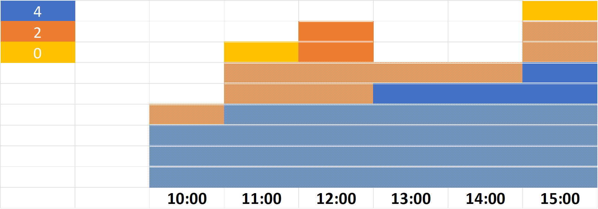

# Infrastructure as Money

::: Notes

Photo by Karolina Grabowska from Pexels
https://www.pexels.com/photo/roll-of-american-dollar-banknotes-tightened-with-band-4386476/

:::

## We need a Kubernetes Cluster

::: Notes

 Foto de Andrea Piacquadio en Pexels

:::

## Fourty CPUs with eighty GB of RAM

::: Notes

Foto de Pok Rie en Pexels
https://www.pexels.com/photo/dell-motherboard-and-central-processing-unit-1432675/

:::

## Ireland region, all numbers in dollars

::: Notes

Foto de RODNAE Productions en Pexels
https://www.pexels.com/es-es/foto/madera-hombre-gente-mujer-7080463/

:::

## Weapons of choice

|                  | c5a.xlarge  | t3a.large  |
| -----------------|:-----------:|:----------:|
| **GB of RAM**    |           8 |          8 |
| **CPUs**         |           4 |          2 |
| **Number of instances**  |  10 |         20 |

::: Notes

Comment we will have two times more ram with the second option
t3 is a bursting instance
Photo by Jay Johnson from Pexels
https://www.pexels.com/photo/snow-wood-light-people-6414384/

:::

::: Notes

Let's say you arrive to the desert and then the photosession starts. You enjoy it deeply, how many cool things are you going to create today.

These series of photos are made by Cottonbro, available on [pexels](https://www.pexels.com/photo/woman-standing-on-top-of-white-chair-5836335/)

:::

::: Notes

After two hours under the Sun, it doesn't feel so exciting anymore

:::

::: Notes

And by the end of the session you just want to kill yourself, exhausted and thirsty

:::

## On demand

::: Notes

Now a cloud provider appears and shows you a super fresh glass of lemonade and tells you: this is what you
are going to pay me for being happy. That is on-demand price.

:::

## On demand pricing

::: Notes

Approximately $15K per year

:::

::: Notes

Your customer is surprised. You feel surprised, too, probably. But this is only for one cluster.

:::

## $45.000 per year

::: Notes

And you have three environments, and you want to keep them on separate clusters. And it is more like $45K per year.

:::

::: Notes

No worries: someone from AWS appears a tells you: commit to one-to-three years of resource/money usage and you will get
a wonderful discount.

Photo by [Mikhail Nilov, on pexels](https://www.pexels.com/photo/woman-in-corporate-attire-holding-a-home-insurance-policy-7736070/)

:::

::: Notes

AWS invoices can be very complex, but it is important to understand how they
work to make sense of the discount options.

Photography by [Elina Fairytale](https://www.pexels.com/photo/two-boys-playing-with-toilet-paper-rolls-4008799/).

:::

## Usage bar diagram

::: Notes

This is a (tiny) part of the bar graph created by grouping the concepts
of the invoice, and filtering by instance type.

:::

## Reservation allocation

::: Notes

We decide to go with four reservations for the blue instance, two for
the orange, and zero for the yellow one (as it usage is sparse).

As we can see, we don't always get a discount for all our instance/hour,
as there are moments in which we have more instances that reservations.

:::

## Reservation waste

::: Notes

But that is not all: we also waste some reservations, because we don't
have a regular usage of the instance (yellow case), or we have less instances
of a type in a given moment that the reservations made.

:::

## Reservations

::: Notes

26-28% savings

:::

::: Notes

In any case, Reservations Plans provide an alternative discount method with a much
more simple approach: commitment to spend money. The granularity is still per
hour, so it is not as straightforward as it looks like.

Picture by [Kenny Boy](https://www.deviantart.com/kenny-boy/art/Scrooge-Mickey-s-Christmas-Carol-776301640)

:::

## Saving plans

::: Notes

37-40% savings

Saving plans are reservations 3.0. The original reservations where focused in commitment to particular
resource types. Saving plans are oriented to commitment of spent, much more flexible and logical.

With EC2 Instance Savings Plans you specify the family, for maximum discount.
With AWS Compute Savings Plans you just set an amount of money that is shared between EC2, Fargate and Lambda

:::

## Up-front payment

::: Notes

It is possible to pay for the saving plan each month,or give away all the money in advance.
As it can be seen in the following diagram, it doesn't make too much sense as the additional savings
are small.

Photo by [Sharon McCutcheon](https://unsplash.com/photos/-8a5eJ1-mmQ)

:::

## Up-front payment

::: Notes

41-44% savings

:::

## Spot instances

::: Notes

A woman from AWS appears to you in the middle of the ir data center and says 
"look, I've plenty of VMs. Borrow them for a fair price."

Photo by [WinSon](https://www.pexels.com/photo/person-sitting-on-ground-between-brown-cardboard-boxes-2701434/)

:::

::: Notes

Spot instances are not related to any bidding. They are very stable, the fluctuating price changes per AZ,
it is very easy to blend different types on the same autoscaling group and in general they are a very safe
option for many scenarios with a hugh discount. 

:::

## Managed group capacity rebalancing

::: Notes

Previously, it was necessary to install an agent on each node for handling spot capacity interruptions.
This is not needed anymore, thanks to the [ASG autoscaling capacity](https://ec2spotworkshops.com/using_ec2_spot_instances_with_eks/040_eksmanagednodegroupswithspot/spotlifecycle.html#interruption-handling-in-eks-managed-node-groups-with-spot-capacity). In a [managed group](https://ec2spotworkshops.com/using_ec2_spot_instances_with_eks/040_eksmanagednodegroupswithspot/workers_terraform.html), the ASG will automatically optimize the
node group for maintaining the workload capacity.

:::

::: Notes

Most workloads on Kubernetes should be stateless, unless you have taken very bad decisions in your life.
That is what happens with the replica set of the lower line: one of their pods has been eliminated, but that
is not a problem by design.
The exception are the databases that are being run inside your cluster, because you love danger situations.
You can see one of them in the photo, painted in red. Well, taints and tolerations can be used to send those
pods to a nodegroup composed of regular instances, instead of spot ones.

:::

::: Notes

And remember: all of this without commitments. Free yourself from that contract. Use spot instances.
>
Photo by [Ketut Subiyanto](https://www.pexels.com/photo/african-american-man-throwing-paper-sheets-up-in-park-4560086/)

:::

::: Notes

Skyscanner is [deploying 100% of their capacity using spot instances](https://aws.amazon.com/blogs/aws/capacity-optimized-spot-instance-allocation-in-action-at-mobileye-and-skyscanner/), including production.

:::

## Spot instances

::: Notes

60-72% savings

:::

::: Notes

What did your grandmother said? "Kid, turn off the lights!!!". Always follow her advice.

Photo by [Edu Carvalho](https://www.pexels.com/photo/woman-wearing-brown-overall-2050999/)

:::

## Lights off

::: Notes

Working for 16 hours each day from Monday to Friday
81-86% savings

:::

::: Notes

Not all your clusters require the same capacity. It is pretty clear that a dev environment can
be much smaller than the production one.
>
Photo by [Elviss Railijs](https://www.pexels.com/photo/green-and-teal-bus-1210622/)

:::

## Partial capacity

::: Notes

94-96% savings expecting a 30% average capacity

:::

::: Notes

Ok, we are almost done. Just keep up with your attention for a few minutes.

Photo by [Andrea Piacquadio](https://www.pexels.com/photo/woman-leaning-on-table-3767411/)

:::

## Full price vs optimized

::: Notes

72-74% savings without any risk derived from spot market
With full spot adoption savings goes to 78-84%!

:::

::: Notes

Uff, ok. Good work.

Photo by [Zichuan Han](https://www.pexels.com/photo/photo-of-fireworks-display-during-evening-3428289/)

:::

## EKS control plane: $876 per year and cluster

::: Notes

73 dollars per month and cluster ($876 per year and cluster)
>
Photo by pixabay on pexels

:::

## EBS, networking, load balancers...

::: Notes

EBS: $1.2 per GB and year
>
Photo by Skyler Erwing on Pexels https://www.pexels.com/@skyler-ewing-266953

:::

## What is the price of a dev/ops?

::: Notes

Photo by [Mark Glancy](https://www.pexels.com/photo/boston-terrier-wearing-unicorn-pet-costume-1564506/)

:::

## Thank you so much!

::: Notes

Sergio garcia: https://www.linkedin.com/in/sergiogarciagil85/
Javi Moreno: https://twitter.com/ciberado/

:::
