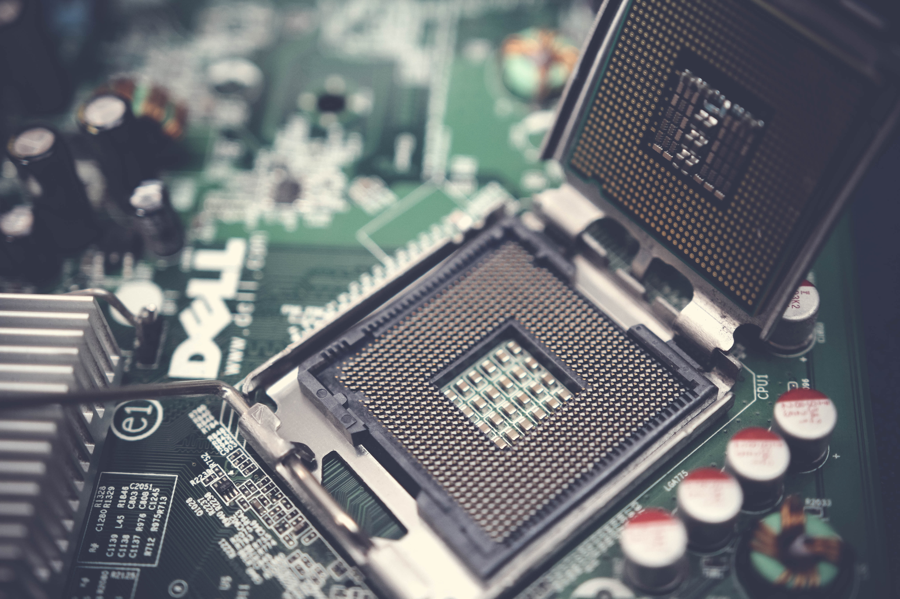

# EKS cost optimization

> Photo by Karolina Grabowska from Pexels
> https://www.pexels.com/photo/roll-of-american-dollar-banknotes-tightened-with-band-4386476/

## We need a Kubernetes Cluster

>  Foto de Andrea Piacquadio en Pexels

## Fourty CPUs with eighty GB of RAM

> Foto de Pok Rie en Pexels
> https://www.pexels.com/photo/dell-motherboard-and-central-processing-unit-1432675/

## Ireland region, all numbers in dollars

> Foto de RODNAE Productions en Pexels
> https://www.pexels.com/es-es/foto/madera-hombre-gente-mujer-7080463/

## Weapons of choice

|                  | c5a.xlarge  | t3a.large  |
| -----------------|:-----------:|:----------:|
| **CPUs**         |           4 |          2 |
| **GB of RAM**    |           8 |          8 |
| **Number of instances**  |  10 |         20 |

> Comment we will have two times more ram with the second option
> t3 is a bursting instance
> Photo by Jay Johnson from Pexels
> https://www.pexels.com/photo/snow-wood-light-people-6414384/

## On demand pricing

> 45K per year for three full clusters

## Reservations

> 26-28% savings

## Saving plans

> 37-40% savings

## Up-front payment

> 41-44% savings

## Spot instances

> 60-72% savings

## Lights off

> Working for 16 hours each day from Monday to Friday
> 81-86% savings

## Partial capacity

> 94-96% savings expecting a 30% average capacity

## Full price vs optimized

> 72-74% savings without any risk derived from spot market
> With full spot adoption savings goes to 78-84%!

## EKS control plane: $876 per year and cluster

> 73 dollars per month and cluster ($876 per year and cluster)
>
> Photo by pixabay on pexels

## EBS, networking, load balancers...

> EBS: $1.2 per GB and year
>
> Photo by Skyler Erwing on Pexels https://www.pexels.com/@skyler-ewing-266953

## What is the price of a dev/ops?

## Thanks
